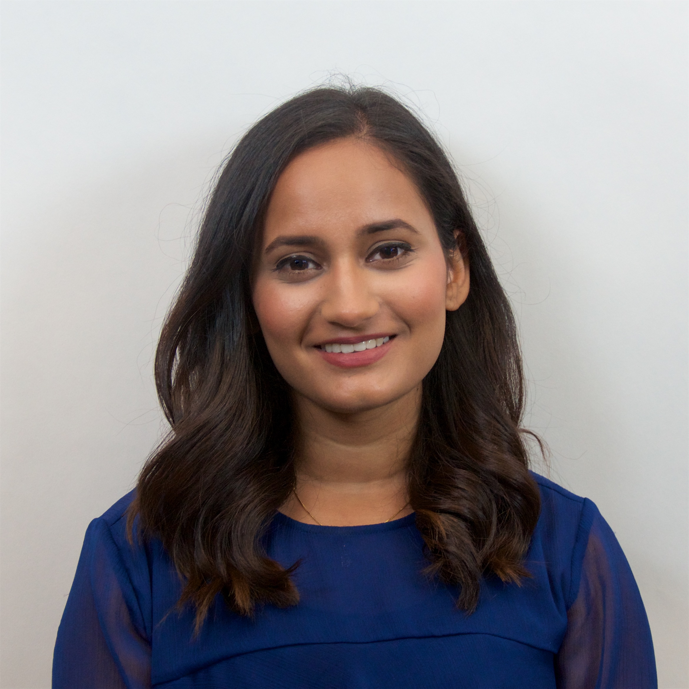

## About Me

I am a first year MS/PhD student at the [College of Computer and Information Sciences](https://www.cics.umass.edu/) at the [University of Massachusetts Amherst](https://www.umass.edu/). As part of the [Knowledge Discovery Lab](https://kdl.cs.umass.edu/display/public/Knowledge+Discovery+Laboratory), I work with Prof. [David Jensen](https://people.cs.umass.edu/~jensen/). My current research interests lie in building and using causal models for complex machine learning and data problems to extract information with a special interest in interdisplinary applications, particularly security and computational social science.

My prior works (produced in my undergrad) have been oriented towards using data mining and machine learning techniques to understand real world issues in the fields of computational social science, information science and applied statistics and mathematics.

Prior to joing UMass, I was a software engineer at IBM where I worked on the IBM z/OS Mainframe. I completed my Bachelors of Science in Mathematics and Computer Science from the State University of New York at Albany.

---

> ~ **The most dangerous phrase in the language is, "We've always done it this way."** ~ -Grace Hopper